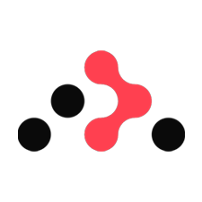
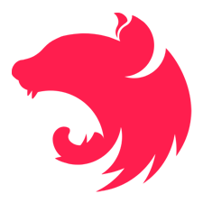
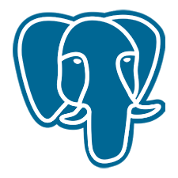

### Hi I'm Luiz 👋

- ⚛️ Fullstack developer
- 🎓 Analysis and Development of Systems student, Graduated in Accounting
- 💻 Passionate about working across the full stack, with a special focus on performance optimization and efficient solutions.
- 🚀 Dedicated to building reliable applications and constantly improving through hands-on experience.

### Languages and Tools

#### Languages

#### Frontend Frameworks & Libraries

#### Backend Technologies & Tools

#### Design & Prototyping

## My latest projects
